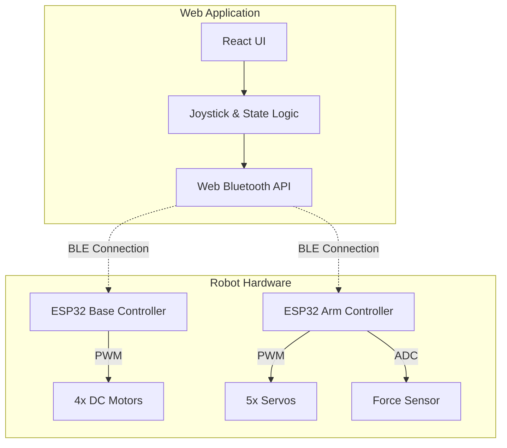

# Grabby - Project Documentation

## 1. Project Overview

**Grabby** is a custom-built mobile manipulator robot designed for the **LAM Research Challenge 2025**. It combines an omnidirectional mecanum wheel base with a 4-DOF robotic arm, all controlled via a high-performance web application using **Web Bluetooth (BLE)**.

### Goals
-   Demonstrate low-latency, app-free robot control using standard web technologies.
-   Provide an intuitive, dual-joystick interface for complex manipulation tasks.
-   Ensure safety and precision through smart firmware logic and sensor feedback.

---

## 2. System Architecture

The system consists of three main nodes: the **Web Controller (Frontend)** and two **ESP32 Microcontrollers** (Hardware).



### Communication Flow
1.  **User Input**: Touch/Mouse events on virtual joysticks.
2.  **Processing**: React state updates velocity/angle targets.
3.  **Transmission**: Commands sent via BLE Characteristics (20Hz update rate).
4.  **Execution**: ESP32 parses commands and drives motors/servos.

---

## 3. Hardware Specifications

### 3.1 Base Controller (Mecanum Chassis)
-   **Microcontroller**: ESP32 Dev Module
-   **Drive System**: 4x DC Motors with Mecanum Wheels
-   **Motor Drivers**: L298N or L293D (Dual H-Bridge)
-   **Power**: 12V LiPo Battery (recommended)

#### Pinout Configuration (`esp32_base.ino`)
| Motor | IN1 | IN2 | EN (PWM) |
| :--- | :--- | :--- | :--- |
| **Front Left** | GPIO 16 | GPIO 17 | GPIO 4 |
| **Front Right** | GPIO 27 | GPIO 26 | GPIO 25 |
| **Rear Left** | GPIO 22 | GPIO 21 | GPIO 32 |
| **Rear Right** | GPIO 19 | GPIO 18 | GPIO 5 |

### 3.2 Arm Controller (4-DOF Manipulator)
-   **Microcontroller**: ESP32 Dev Module
-   **Actuators**: 5x Servos (SG90 / MG996R)
-   **Sensors**: Force Sensitive Resistor (FSR) for Gripper
-   **Power**: 5V High-Current Supply (External BEC recommended)

#### Pinout Configuration (`esp32_arm.ino`)
| Component | GPIO Pin | Function |
| :--- | :--- | :--- |
| **Base Servo** | GPIO 2 | Rotation (0-180°) |
| **Shoulder Servo** | GPIO 4 | Lift (0-180°) |
| **Elbow Servo** | GPIO 5 | Extension (0-180°) |
| **Wrist Servo** | GPIO 18 | Rotation (0-180°) |
| **Gripper Servo** | GPIO 19 | Open/Close (0-110°) |
| **FSR Sensor** | GPIO 34 | Pressure Feedback (ADC) |

---

## 4. Software Architecture

### 4.1 Frontend Application
Built with **React 19**, **Vite**, and **Tailwind CSS 4**.

#### Key Components
-   **`App.jsx`**: Main controller logic. Handles state, UI layout, and the main control loop.
-   **`Joystick` Component**: A reusable, multi-touch enabled virtual joystick. Calculates normalized vectors (x, y) from user input.
-   **`useBluetoothController` Hook**: Encapsulates BLE connection logic (connect, disconnect, write).

#### State Management
-   **Base**: `baseVx`, `baseVy` (Velocity vectors).
-   **Arm**: `armBase`, `armShoulder`, `armElbow`, `armWrist`, `armGripper` (Absolute angles).
-   **Arm Control**: Uses velocity inputs (`armVx`, `armVy`) to increment/decrement angles for smooth motion.

### 4.2 Firmware Structure
Both ESP32s run Arduino-based firmware using the `ESP32Servo` and `BLEDevice` libraries.

#### Core Loop
1.  **BLE Callbacks**: Receive string commands asynchronously.
2.  **Parsing**: Extract numeric values from protocol strings.
3.  **Actuation**:
    -   **Base**: Calculate mecanum mixing and set PWM.
    -   **Arm**: `servo.write()` to target angles.
4.  **Safety**:
    -   **Base**: Auto-stop if no command received (watchdog).
    -   **Arm**: FSR threshold check prevents gripper crushing.

---

## 5. Communication Protocols

**Service UUID**: `0000FFE0-0000-1000-8000-00805F9B34FB`
**Characteristic UUID**: `0000FFE1-0000-1000-8000-00805F9B34FB`

### 5.1 Base Protocol
| Command Type | Format | Description | Example |
| :--- | :--- | :--- | :--- |
| **Move** | `M:vx:vy` | Velocity vector (-1.0 to 1.0) | `M:0.5:-0.8` |
| **Control** | `C:cmd` | Discrete actions | `C:rotleft`, `C:stop` |
| **Speed** | `S:val` | Set max rotation speed (0-255) | `S:200` |

### 5.2 Arm Protocol
| Command Type | Format | Description | Example |
| :--- | :--- | :--- | :--- |
| **Set Pose** | `A:b:s:e:w:g` | Absolute angles for all joints | `A:90:45:120:90:0` |

*Note: `b`=Base, `s`=Shoulder, `e`=Elbow, `w`=Wrist, `g`=Gripper*

---

## 6. Control Logic & Kinematics

### 6.1 Mecanum Kinematics (Base)
The base uses standard mecanum wheel mixing formulas to achieve holonomic motion:
```cpp
FrontLeft  = Vy + Vx
FrontRight = Vy - Vx
RearLeft   = Vy - Vx
RearRight  = Vy + Vx
```
*Note: Rotation is handled separately via discrete buttons to simplify the joystick logic.*

### 6.2 Arm Control Logic
-   **Velocity-to-Position**: The joystick sends velocity. The app integrates this over time to update the target angle.
    -   `NewAngle = CurrentAngle + (Input * SpeedFactor)`
-   **Inverted Shoulder**: The UI maps 0-70° (Up) to Servo 70-0° (Physical) to match mechanical mounting.
-   **Homing**: A "Home" button smoothly interpolates all joints to a safe parking position (`90, 0, 180, 110, 110`).

### 6.3 Safety Features
1.  **Connection Monitoring**: Joysticks disabled if BLE disconnects.
2.  **Heartbeat**: Base stops if commands cease (prevents runaway).
3.  **Software Limits**: Angles constrained in React state (e.g., Shoulder 0-70°).
4.  **Gripper Safety**: Firmware ignores "Close" commands if FSR > `FSR_THRESHOLD`.

---

## 7. User Interface Guide

### Layout
-   **Landscape Only**: Enforced via CSS and JS checks.
-   **Left Zone**: Cyan Joystick for Base Movement.
-   **Center Zone**:
    -   **Top Bar**: Connection buttons (Gamepad/Hand), Homing, Speed, Fullscreen.
    -   **Sliders**: Fine-tune Base Rotation and Wrist Angle.
    -   **Bottom**: Rotate Left/Right buttons, Gripper Open/Close (Hold-to-move).
-   **Right Zone**: Purple Joystick for Arm (Shoulder/Elbow).

### Usage
1.  **Connect**: Tap Gamepad (Base) and Hand (Arm) icons.
2.  **Drive**: Drag Left Joystick.
3.  **Manipulate**: Drag Right Joystick.
4.  **Grab**: Hold "Close" to grip object (stops on pressure).

---

## 8. Setup & Installation

### 8.1 Firmware
1.  Install **Arduino IDE** and **ESP32 Board Support**.
2.  Install `ESP32Servo` library.
3.  Flash `esp32_base.ino` to Base ESP32.
4.  Flash `esp32_arm.ino` to Arm ESP32.

### 8.2 Web App
1.  Clone repo: `git clone https://github.com/venky24K/grabby.git`
2.  Install: `npm install`
3.  Run: `npm run dev`
4.  Open `http://localhost:5173` in Chrome/Edge (Desktop or Android) or Bluefy (iOS).
